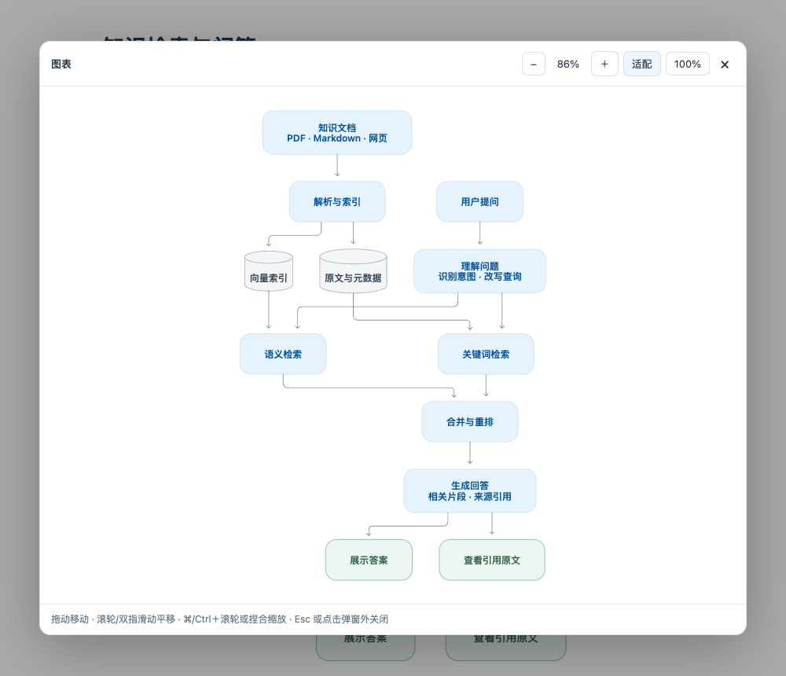

# Typora Codex Mermaid

从 **Codex 桌面应用提取 Mermaid 渲染器**并接入 Typora，加入**点击放大预览**，支持拖动、缩放、明暗主题及 HTML / PDF / Word 导出。安装后打开已有文档即可使用，预览不会修改 Markdown。

## 效果展示

以下图片由插件实际渲染；安装后可打开[示例文档](examples/demo.md)编辑、放大查看。

| 内容发布流程 | 知识检索与问答 |
| --- | --- |
|  |  |
| [Mermaid 源码](examples/publishing-workflow.mmd) | [Mermaid 源码](examples/knowledge-search.mmd) |

## 安装

适用于 macOS，需已安装 Typora。

### 成品包安装

无需 Codex、Node.js、Python 或社区插件框架。

1. [下载 macOS 安装包](https://github.com/wuyak/typora-codex-mermaid/releases/download/v1.2.1/typora-codex-mermaid-1.2.1-macos.zip)并解压，完整退出 Typora。
2. 双击 `Install.command`，等待安装成功。
3. 重新打开 Typora，用包内的[图表示例](examples/demo.md)试用。

[所有版本](https://github.com/wuyak/typora-codex-mermaid/releases) · GitHub 的“Download ZIP”是需自行构建的源码。

### 源码安装

克隆仓库或下载源码并解压，准备 **Node.js ≥ 22.16** 和 **Codex 桌面应用 26.924.22138**。提取器依赖该固定版本，不支持任意新版。

完整退出 Typora，在源码根目录运行：

```bash
npm ci
npm run extract
npm run build
npm run install:typora
```

安装后重新打开 Typora。Codex 安装路径不同或需要测试、打包时，见[开发文档](docs/DEVELOPMENT.md)。源码安装可用 `npm run uninstall:typora` 卸载。

## 使用

打开含有 `mermaid` 代码块的文档，图表会自动渲染。



| 操作 | 方法 |
| --- | --- |
| 打开预览 | 单击图表 |
| 缩放 | `＋` / `−`、`⌘/Ctrl`＋滚轮，或触控板捏合 |
| 平移 | 拖动、滚轮或双指滑动 |
| 查看全图 / 原始尺寸 | “适配” / “100%” |
| 返回正文 | `Esc`、`×` 或点击弹窗外 |
| 修改 Mermaid | 点击正文中图表右上角“编辑源码” |

缩放只影响预览中的图表。分享时可导出 HTML、PDF 或 Word；单独发送 `.md` 不会携带插件。

## 兼容与卸载

- 流程图采用专门布局；时序图、类图、状态图、ER 图、饼图和甘特图已有示例验证。`classDef` 配色保留，多数 `init` 配置和 `click` 指令会被过滤。
- 已在 **macOS 环境（Typora 1.13.4 / 7690）实测可用**，HTML、PDF、Word 导出已验证；其他 Typora 版本及 Windows / Linux 尚未验证。
- 卸载：退出 Typora，运行 `Uninstall.command`。Typora 更新后可能需要重新安装插件。

[安装路径与问题处理](docs/INSTALL.md) · [开发与构建](docs/DEVELOPMENT.md) · [来源声明](NOTICE)
