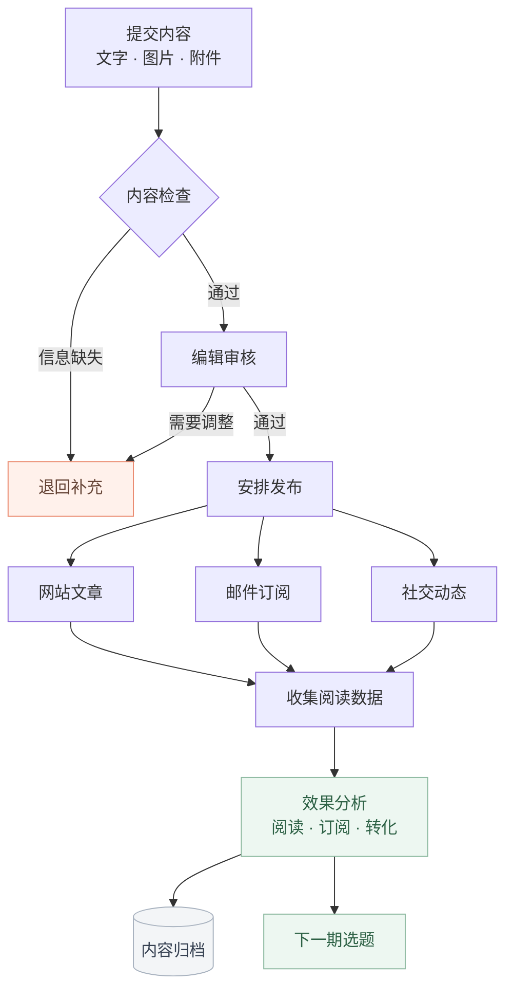
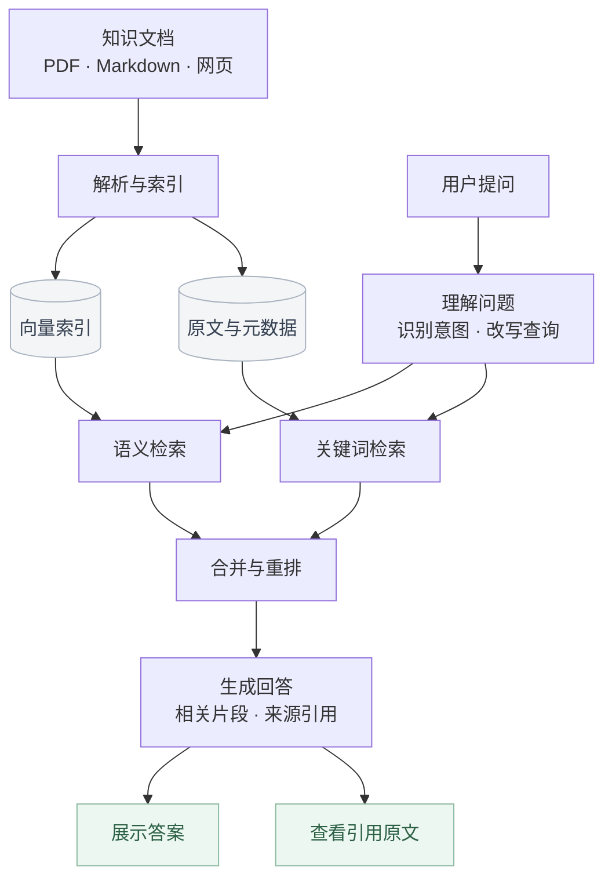
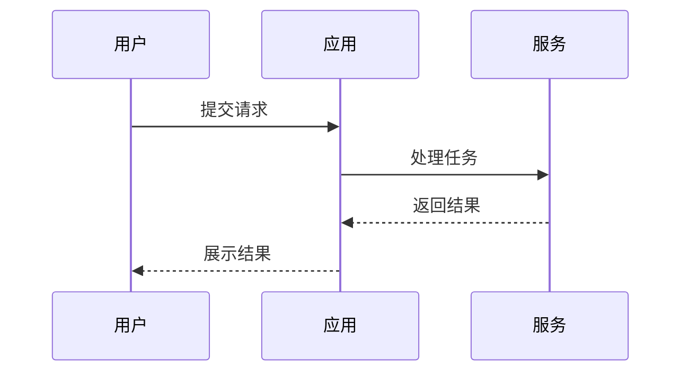
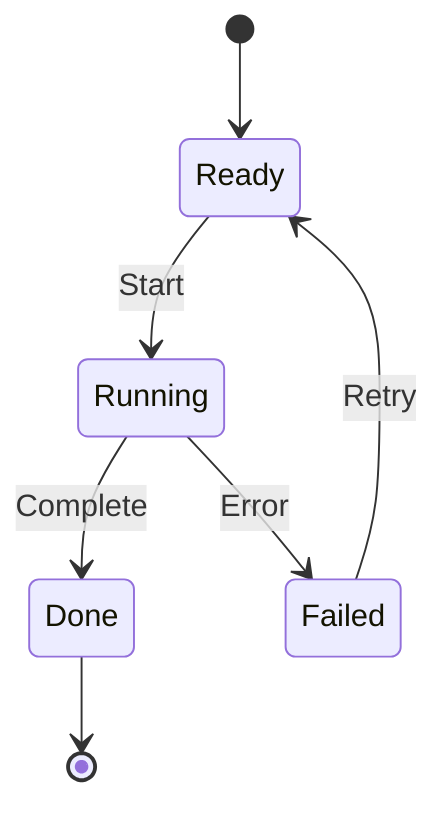

# 图表预览示例

安装插件后，用 Typora 打开本文件。单击图表打开预览，点击“编辑源码”修改 Mermaid。

## 内容发布流程

```mermaid
flowchart TB
    Draft[提交内容<br/>文字 · 图片 · 附件] --> Check{内容检查}
    Check -->|信息缺失| Revise[退回补充]
    Check -->|通过| Review[编辑审核]
    Review -->|需要调整| Revise
    Review -->|通过| Schedule[安排发布]
    Schedule --> Web[网站文章]
    Schedule --> Mail[邮件订阅]
    Schedule --> Feed[社交动态]
    Web --> Stats[收集阅读数据]
    Mail --> Stats
    Feed --> Stats
    Stats --> Report[效果分析<br/>阅读 · 订阅 · 转化]
    Report --> Archive[(内容归档)]
    Report --> Plan[下一期选题]
    classDef note fill:#fff1eb,stroke:#ea8b70,color:#654436
    classDef storage fill:#f3f5f7,stroke:#a8b2bf,color:#364152
    classDef success fill:#edf7f1,stroke:#8db9a0,color:#2d6145
    class Revise note
    class Archive storage
    class Report,Plan success
```

## 知识检索与问答

```mermaid
flowchart TB
    Docs[知识文档<br/>PDF · Markdown · 网页] --> Parse[解析与索引]
    Parse --> Index[(向量索引)]
    Parse --> Store[(原文与元数据)]
    User[用户提问] --> Query[理解问题<br/>识别意图 · 改写查询]
    Query --> Vector[语义检索]
    Query --> Keyword[关键词检索]
    Index --> Vector
    Store --> Keyword
    Vector --> Rank[合并与重排]
    Keyword --> Rank
    Rank --> Model[生成回答<br/>相关片段 · 来源引用]
    Model --> Answer[展示答案]
    Model --> Citations[查看引用原文]
    classDef storage fill:#f3f5f7,stroke:#a8b2bf,color:#364152
    classDef success fill:#edf7f1,stroke:#8db9a0,color:#2d6145
    class Index,Store storage
    class Answer,Citations success
```

## 时序图

```mermaid
sequenceDiagram
    participant U as 用户
    participant A as 应用
    participant S as 服务
    U->>A: 提交请求
    A->>S: 处理任务
    S-->>A: 返回结果
    A-->>U: 展示结果
```

## 状态图

```mermaid
stateDiagram-v2
    [*] --> Ready
    Ready --> Running: Start
    Running --> Done: Complete
    Running --> Failed: Error
    Failed --> Ready: Retry
    Done --> [*]
```
